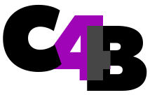

<div align="center" id="top"> 
  

  &#xa0;

  <!-- <a href="https://backend.netlify.app">Demo</a> -->
</div>

<h1 align="center"> C4B - Restful API</h1>

<p align="center">
  

  

  

  
</p>

<!-- Status -->

<!-- <h4 align="center"> 
	🚧  Backend 🚀 Under construction...  🚧
</h4> 

<hr> -->

<p align="center">
  <a href="#dart-about">About</a> &#xa0; | &#xa0; 
  <a href="#sparkles-features">Features</a> &#xa0; | &#xa0;
  <a href="#rocket-technologies">Technologies</a> &#xa0; | &#xa0;
  <a href="#white_check_mark-requirements">Requirements</a> &#xa0; | &#xa0;
  <a href="#checkered_flag-starting">Starting</a> &#xa0; | &#xa0;
  <a href="#memo-license">License</a> &#xa0; | &#xa0;
  <a href="https://github.com/42voyager" target="_blank">Authors</a>
</p>

<br>

## :dart: About ##

This project served as a base for a Bank Loan Request App in which an API could be able to receive Loan Requests, send emails to customers and bank account owners, and finally generate contracts between the Bank and the customer.

We released it for people who wants a boilerplate for a similar Restful API project using .NET framework.

## :sparkles: Features ##

:heavy_check_mark: Fully Restfull API \
:heavy_check_mark: Email Service \
:heavy_check_mark: Pdf Contract Service \
:heavy_check_mark: E2E Tests for sites that uses this API \
:heavy_check_mark: Swagger support 

## :rocket: Technologies ##

The following tools were used in this project:

- [C#](https://docs.microsoft.com/en-us/dotnet/csharp/)
- [.NET](https://dotnet.microsoft.com/en-us/)
- [SQLite](https://www.sqlite.org/index.html)
- [Playwright](https://playwright.dev/https://reactnative.dev/)

## :white_check_mark: Requirements ##
Ubuntu was used to implement the project, so the .net SDK is required to be installed first. See Microsoft docs in this [link](https://docs.microsoft.com/en-us/dotnet/core/install/linux-ubuntu)

## :checkered_flag: Starting ##


```bash
# Clone this project
$ git clone https://github.com/42voyager/c4b-backend

# Access
$ cd backend

# Run API Server
dotnet run --project api/backend.csproj

# The Swagger server will initialize in http://localhost:5000/swagger/index.html
```

## :eyes: Swagger ##

The app on development will enable the Swagger Service. It can be accessed by running http://localhost:5000/swagger/index.html on the local development machine.


## :honeybee: Issues ##

Feel free to submit issues and enhancement requests.

## :waxing_crescent_moon: Contributing ##

Please refer to each project's style and contribution guidelines for submitting patches and additions. In general, we follow the "fork-and-pull" Git workflow.

 1. **Fork** the repo on GitHub
 2. **Clone** the project to your own machine
 3. **Commit** changes to your own branch
 4. **Push** your work back up to your fork
 5. Submit a **Pull request** so that we can review your changes

NOTE: Be sure to merge the latest from "upstream" before making a pull request!

## :memo: License ##

This project is under license from MIT. For more details, see the [LICENSE](LICENSE.md) file.

Made with :heart: by <a href="https://github.com/pacorocha" target="_blank">Paco Rocha</a>
<a href="https://github.com/diegocl02" target="_blank">Diego Cisneros</a> <a href="https://github.com/MarcusVinix" target="_blank">Marcus Vinicius</a>

&#xa0;

<a href="#top">Back to top</a>
